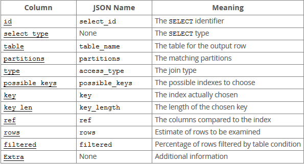

## mysql的执行计划解读

1. type描述了扫描方式  从上到下 从优到劣

   | type   | 解释                                                         |
   | ------ | ------------------------------------------------------------ |
   | all    | 不适用索引的全表扫描                                         |
   | index  | 全索引扫描                                                   |
   | range  | 范围索引  =, <>, >, >=, <, <=, IS NULL, <=>, BETWEEN, LIKE, or IN() |
   | ref    | 索引等于多行=,<=>                                            |
   | eq_ref | 索引等于 一行                                                |
   | const  | 常数 很快                                                    |
   | system | 系统 很快                                                    |
