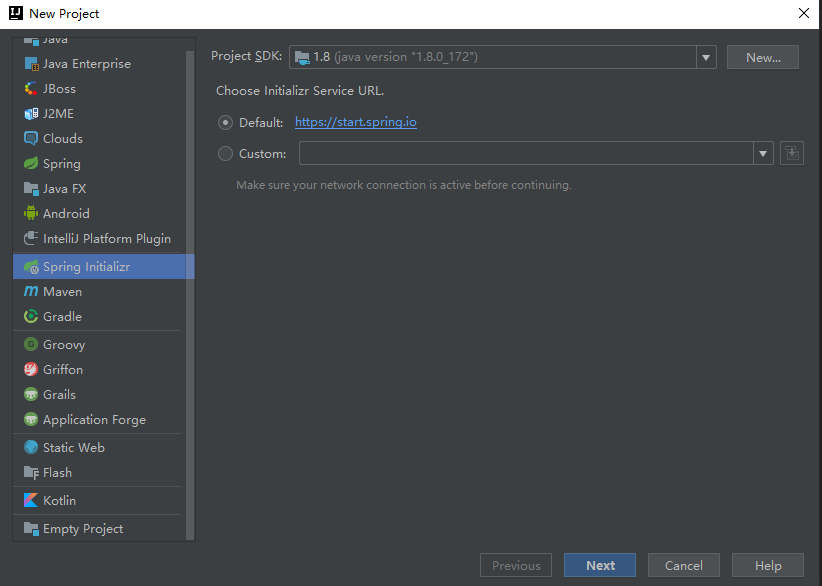
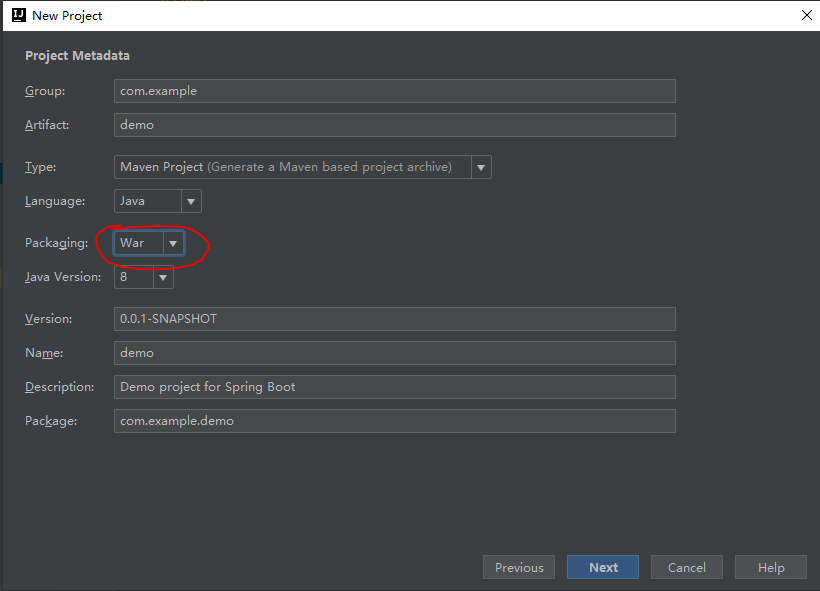
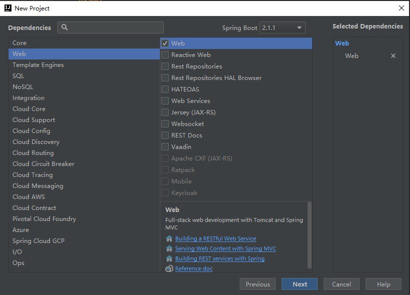
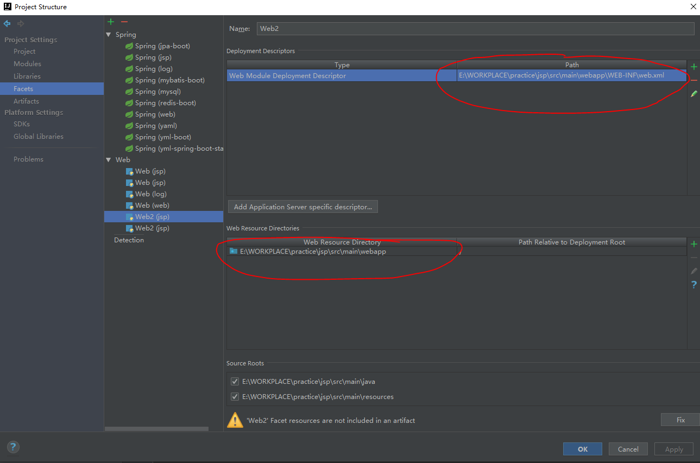
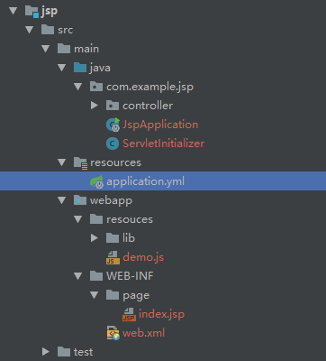

## springboot 使用jsp打包成war部署到外部tomcat

1. idea创建springboot项目，设置打包方式为war，依赖选中web
   
   

   

2. 创建webapp目录，生成web.xml

   

3. application.yml中指定jsp视图的位置和后缀

   ```xml
   spring:
     mvc:
       view:
         prefix: /WEB-INF/page/
         suffix: .jsp
   ```

### 完整的项目结构




